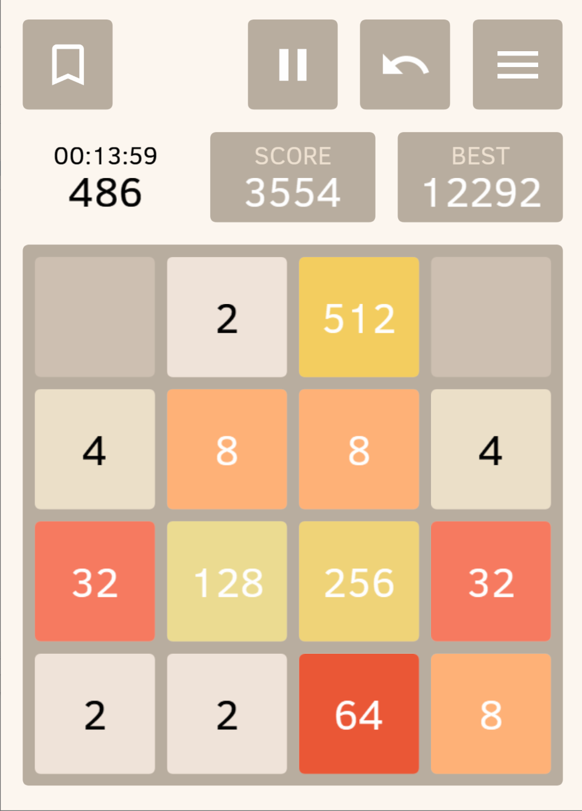
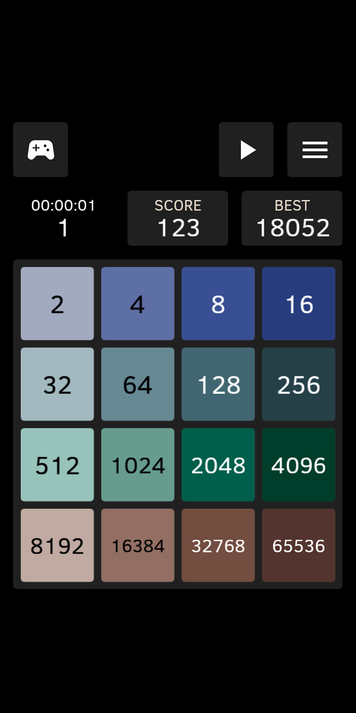
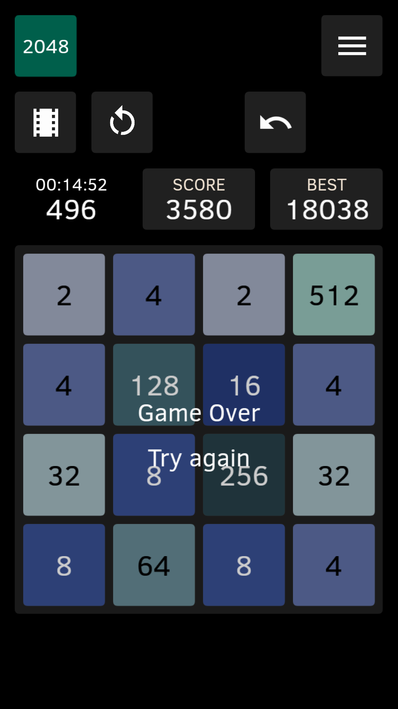
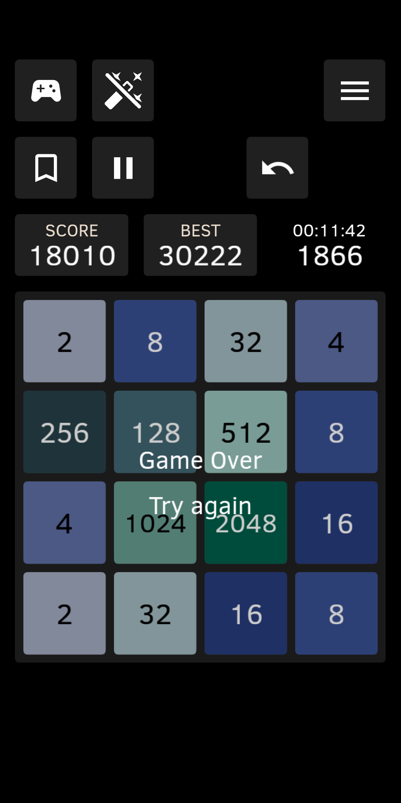
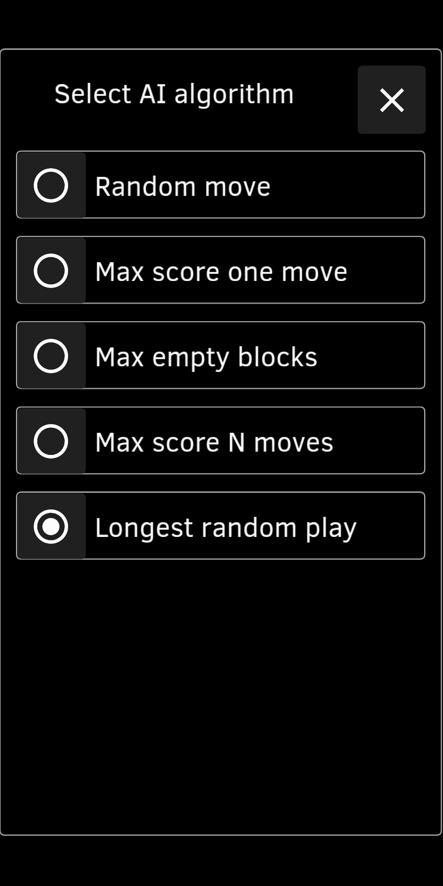

# 2048 Open Fun Game

2048 game with AI, Bookmarks, Auto Replay, History and other fun features,
Open Source, no ads

This is [2048 game](https://en.wikipedia.org/wiki/2048_(video_game)) multiplatform implementation
 in [Kotlin](https://kotlinlang.org/) programming language
 and [KorGe game engine](https://korge.org/).

**Android**.  The latest Beta Android build is available [here](https://github.com/andstatus/game2048/issues/1).

[](https://play.google.com/store/apps/details?id=org.andstatus.game2048)

**Windows X64** zipped executable is [here](https://github.com/andstatus/game2048/issues/2). 

<a id="features"/>

## How to play

Swipe the game board to move all tiles left, right, up, or down.
When two tiles with the same number touch, they merge into one with a double number,
i.e. 2+2 merge into 4, 4+4 merge into 8 and so on.
The goal is to create a tile with the highest number.
Number 2048 is a good first win…

We have quite a long video post at Youtube demonstrating the app features,
see [User experience](doc/User-Experience.md).

### Features of "2048 Open Fun Game" that are not present in the original game

* Unlimited and animated Undo and Redo.
* Select theme for the app: Device default (for Android 9+), Dark or Light.
  Dark theme for Android 9+ is turned on by default when system-wide "Dark theme" is turned on in device settings.
* Turn on AI (Artificial Intelligence) mode and let the AI play for you.
  Increase or decrease AI player speed. Stop it and continue playing yourself.
  Choose one of several AI algorithms, see how they play and compare them.
* Bookmarks at the interesting game positions. Return to a bookmark and play again from that place.
* Move number and game duration shown. The time starts when you make a move.
  It stops when you tap Undo or Pause button.
* "Watch" mode. Auto replay current game forward and backwards at any speed,
  stop at any position.
  Switch to "Play" mode from that place and continue playing, overriding history.
* The Latest games with all their moves, bookmarks and scores are stored in a history and can be watched.
  Or you can play them again.
* Game menu allows you to delete current game from history, to restart a game ("Try again")
  or to restore existing game from a list.
* When you tap "Try again" button or restore existing game, current game is automatically saved to the history,
  so you can review or continue to play it later.
* Share a game as a file, so it can be loaded, watched and even played on any other device.
* The app is multilingual. Please add new translations [2048 Open Fun Game at Crowdin](https://crowdin.com/project/2048-open-fun-game)

<p>











</p>

Privacy policy is [here](doc/Privacy-Policy.md).

If you found the project useful, please 
[donate to the 2048 game development](http://andstatus.org/donate.html) via its lead developer.

## About the project

The project started from [RezMike/2048 KorGe tutorial project](https://github.com/RezMike/2048#readme), 
but it's not a clone of that repository: it's a rewrite aiming at becoming a (board) game template
that is easy to modify, to extend and to play with using [Kotlin](https://kotlinlang.org/) programming language
and [KorGe game engine](https://korge.org/).

Following this goal, the source code has been structured and cleaned. We're trying to use 
board games terminology (e.g. [Glossary of chess](https://en.wikipedia.org/wiki/Glossary_of_chess))
in order to ease understanding of implementation logic.

Game exchange text format created (JSON based) to allow users share  
and load shared games with all moves and bookmarks.

## Contribution

* Your ideas and suggestions are welcome at [Issues section](https://github.com/andstatus/game2048/issues). 
* The app is multilingual. Please help to translate the app into your language:
[2048 Open Fun Game at Crowdin](https://crowdin.com/project/2048-open-fun-game).

<a id="changelog"/>

## Changelog

No changes yet, please see [Features](#features).

# How to run the project

## Android-specific project
This multiplatform project has additional Android-specific project that is customized to have
richer User experience on Android platform.
The project is in the *game2048-android* subfolder and can be opened and run using Android Studio.  
It consists of build configuration files, and it reuses common source code.

## JVM target
Use "jvmRun" Gradle task to start the game as a Java application (i.e. no need for Android device or emulator).

Additional arguments:

 Argument | Description
----------|-------------
-Duser.color.theme=dark             | switch to the Dark Theme
-Duser.language=ru                  | switch to Russian locale ("zh" - to Chinese Simplified)
-Duser.screen.orientation=landscape | landscape screen orientation ("tall" - taller screen)

# Running instructions from Korge template project
The implementation uses the [KorGe template project](https://github.com/korlibs/korge-hello-world#readme).
Below are the compiling and running instructions taken from the template.

You can open this project in IntelliJ IDEA by opening the folder or the build.gradle.kts file.

For Windows, change all the `./gradlew` for `gradlew.bat`.

You should use Gradle 5.5 or greater and Java 8 or greater.

## Compiling for the JVM (Desktop)

Inside IntelliJ you can go to the `src/commonMain/kotlin/main.kt` file and press the green ▶️ icon
that appears to the left of the `suspend fun main()` line.

Using gradle tasks on the terminal:

```bash
./gradlew runJvm                    # Runs the program
./gradlew packageJvmFatJar          # Creates a FAT Jar with the program
./gradlew packageJvmFatJarProguard  # Creates a FAT Jar with the program and applies Proguard to reduce the size
```

Fat JARs are stored in the `/build/libs` folder.

## Compiling for the Web

Using gradle tasks on the terminal:

```bash
./gradlew jsWeb                     # Outputs to /build/web
./gradlew jsWebMin                  # Outputs to /build/web-min (applying Dead Code Elimination)
./gradlew jsWebMinWebpack           # Outputs to /build/web-min-webpack (minimizing and grouping into a single bundle.js file)
./gradlew runJs                     # Outputs to /build/web, creates a small http server and opens a browser
```

You can use any HTTP server to serve the files in your browser.
For example using: `npm -g install http-server` and then executing `hs build/web`.

You can also use `./gradlew -t jsWeb` to continuously building the JS sources and running `hs build/web` in another terminal.
Here you can find a `testJs.sh` script doing exactly this for convenience.

You can run your tests using Node.JS by calling `jsTest` or in a headless chrome with `jsTestChrome`.

## Compiling for Native Desktop (Windows, Linux and macOS)

Using gradle tasks on the terminal:

```bash
./gradlew linkDebugExecutableMacosX64         # Outputs to /build/bin/macosX64/mainDebugExecutable/main.kexe
./gradlew linkDebugExecutableLinuxX64         # Outputs to /build/bin/linuxX64/mainDebugExecutable/main.kexe
./gradlew linkDebugExecutableMingwX64         # Outputs to /build/bin/mingwX64/mainDebugExecutable/main.exe
```

Note that windows executables doesn't have icons bundled.
You can use [ResourceHacker](http://www.angusj.com/resourcehacker/) to add an icon to the executable for the moment.
Later this will be done automatically.

### Cross-Compiling for Linux/Windows

If you have docker installed, you can generate native executables for linux and windows
using the cross-compiling gradle wrappers:

```bash
./gradlew_linux linkDebugExecutableLinuxX64   # Outputs to /build/web
./gradlew_win   linkDebugExecutableMingwX64   # Outputs to /build/web
```

### Generating MacOS `.app`

```bash
./gradlew packageMacosX64AppDebug             # Outputs to /build/unnamed-debug.app
```

You can change `Debug` for `Release` in all the tasks to generate Release executables.

You can use the `strip` tool from your toolchain (or in the case of windows found in the ``~/.konan` toolchain)
to further reduce Debug and Release executables size by removing debug information (in some cases this will shrink the EXE size by 50%).

In windows this exe is at: `%USERPROFILE%\.konan\dependencies\msys2-mingw-w64-x86_64-gcc-7.3.0-clang-llvm-lld-6.0.1\bin\strip.exe`.

### Linux notes

Since linux doesn't provide standard multimedia libraries out of the box,
you will need to have installed the following packages: `freeglut3-dev` and `libopenal-dev`.

In ubuntu you can use `apt-get`: `sudo apt-get -y install freeglut3-dev libopenal-dev`.

## Compiling for Android

You will need to have installed the Android SDK in the default path for your operating system
or to provide the `ANDROID_SDK` environment variable. The easiest way is to install Android Studio.

Using gradle tasks on the terminal:

### Native Android (JVM)

```bash
./gradlew installAndroidDebug             # Installs an APK in all the connected devices
./gradlew runAndroidEmulatorDebug         # Runs the application in an emulator
```

Triggering these tasks, it generates a separate android project into `build/platforms/android`.
You can open it in `Android Studio` for debugging and additional tasks. The KorGE plugin just
delegates gradle tasks to that gradle project.

### Apache Cordova (JS)

```bash
./gradlew compileCordovaAndroid           # Just compiles cordova from Android
./gradlew runCordovaAndroid               # Runs the application (dce'd, minimized and webpacked) in an Android device
./gradlew runCordovaAndroidNoMinimized    # Runs the application in Android without minimizing (so you can use `chrome://inspect` to debug the application easier)
```


## Compiling for iOS

You will need XCode and to download the iOS SDKs using Xcode.

Using gradle tasks on the terminal:

### Native iOS (Kotlin/Native) + Objective-C

Note that the necessary bridges are built using Objective-C instead of Swift, so the application
won't include Swift's runtime.

```bash
./gradlew iosBuildSimulatorDebug          # Creates an APP file
./gradlew iosInstallSimulatorDebug        # Installs an APP file in the simulator
./gradlew iosRunSimulatorDebug            # Runs the APP in the simulator

```

These tasks generate a xcode project in `build/platforms/ios`, so you can also open the project
with XCode and do additional tasks there.

It uses [XCodeGen](https://github.com/yonaskolb/XcodeGen) for the project generation
and [ios-deploy](https://github.com/ios-control/ios-deploy) for deploying to real devices.

### Apache Cordova (JS)

```bash
./gradlew compileCordovaIos               # Just compiles cordova from iOS
./gradlew runCordovaIos                   # Runs the application (dce'd, minimized and webpacked) in an iOS device
./gradlew runCordovaIosNoMinimized        # Runs the application in iOS without minimizing (so you can use Safari on macOS to debug the application easier)
```
